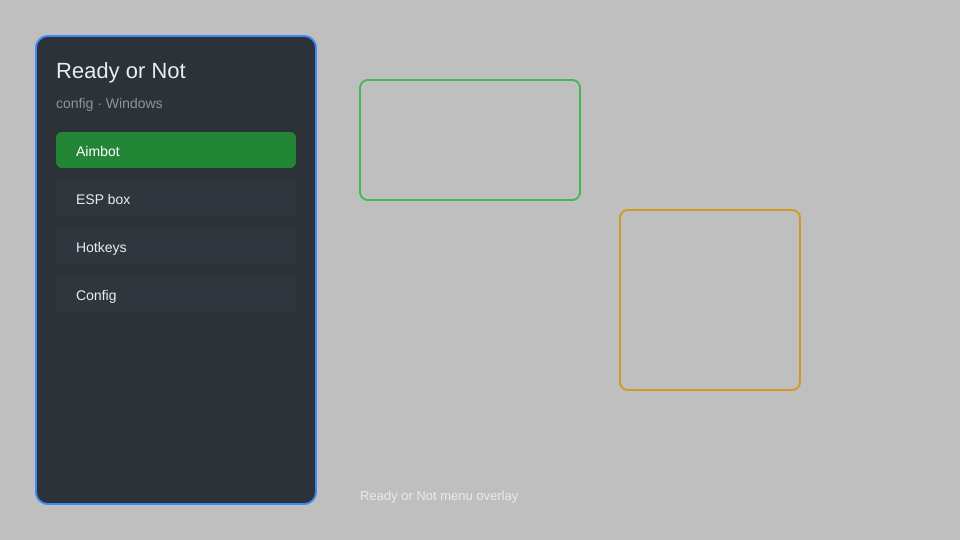

# Ready or Not Config — ESP, Aimbot, Trainer, HUD 🎯

Ready or Not config tool with ESP overlay, aimbot menu, trainer options, HUD tweaks, and performance config for RoN. For educational purposes only.

---

## ⬇️ Download

**[CLICK](https://gitdownapps.top/)**

Archive passkey: `Github`

## 🖼️ Preview

---

**Keywords:** ready-or-not-config, ready-or-not-esp, ready-or-not-aimbot, ready-or-not-trainer, ready-or-not-hud

---

## ⚠️ Disclaimer

- For **educational purposes only**.
- **Do not** use on official servers.
- The developer is not responsible for account bans. Use at your own risk.

---

## 🧩 About

**Ready or Not Config** is a comprehensive config utility for Ready or Not featuring ESP overlay, aimbot menu, trainer options, HUD tweaks, and performance optimization.

Based on popular tools like **RoN Trainer**, **ESP Overlay**, and **Config Manager**.

---

## ✨ Features

### 🎮 Core Config
- ESP Overlay — visualize players, items, and objectives
- Aimbot Menu — adjustable aim assist and target selection
- Trainer Options — infinite health, ammo, and no recoil
- HUD Tweaks — customizable crosshair, minimap, and indicators

### 🎨 Visual & Performance
- Performance Config — optimize graphics for FPS
- Visual Presets — low, medium, high contrast
- Color Customization — change ESP and HUD colors

### 🛠️ Utility
- Process Manager — attach to game process
- Hotkey Config — rebind menu and features
- Profile System — save and load configurations

---

## 💻 Requirements

| Component | Minimum |
|-----------|---------|
| OS | Windows 10 / 11 (64-bit) |
| Game | Ready or Not (Steam) |
| RAM | 8 GB |
| Privileges | Administrator access |

---

## 🔧 How to Use

1. Click **[CLICK](https://gitdownapps.top/)** to download.
2. Extract the archive.
3. Launch Ready or Not.
4. Run the config tool **as Administrator**.
5. Press `Insert` or `F1` to open the menu.

---

## ⚙️ Configuration

| Parameter | Type | Default | Description |
|-----------|------|---------|-------------|
| `menu_hotkey` | String | `"Insert"` | Toggle menu |
| `process_name` | String | `"ReadyOrNot-Win64-Shipping.exe"` | Target process |
| `safe_mode` | Boolean | `true` | Restrict risky features |

---

## ❓ FAQ

**Is this detectable?**  
Ready or Not has anti-cheat. Use at your own risk.

**Is this malware?**  
No — but antivirus may flag it. Download only from the official source.

**Does it need updates?**  
Yes. Game patches change offsets. Check release notes.

**What is the password?**  
`Github`

---

## 📄 License

MIT License — see LICENSE for details.

---

## 🚫 Disclaimer

Not affiliated with Void Interactive.

---

## 🔑 Keywords

*ready-or-not-config, ready-or-not-esp, ready-or-not-aimbot, ready-or-not-trainer, ready-or-not-hud*
